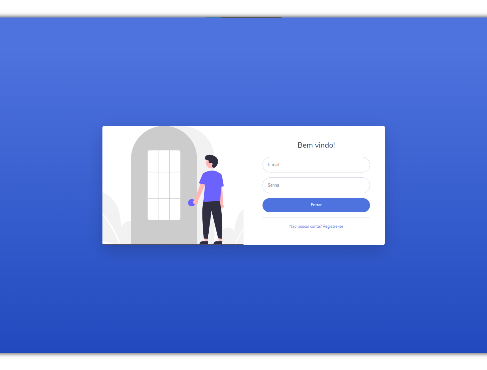
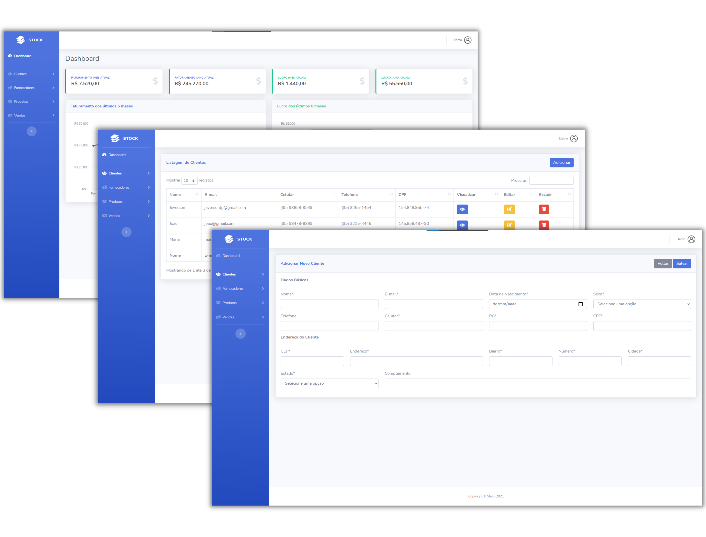

  

## 📃 Descrição

Stock é uma aplicação para controle de estoque

  

  

## 🔒 Dados de Acesso

### Acesse o [Stock](http://stock.jeversong.tech/) 

- Email: demo@demo.com
- Senha: demo1234

## 📋 Funcionalidades

- [x] Dashboard com faturamento e lucro
- [x] Gerenciamento de clientes
- [x] Gerenciamento de fornecedores
- [x] Gerenciamento de produtos
- [x] Gerenciamento de vendas

## 🛠 Ferramentas

- [PHP](https://php.net/)
- [Codeigniter 3](https://codeigniter.com/)
- [MariaDB](https://mariadb.org/)

## 👦 Autor

Desenvolvido por <b>Jeverson Gonçalves</b> 👊😎👊   

## 📑 Licença

O projeto é [MIT](LICENSE).